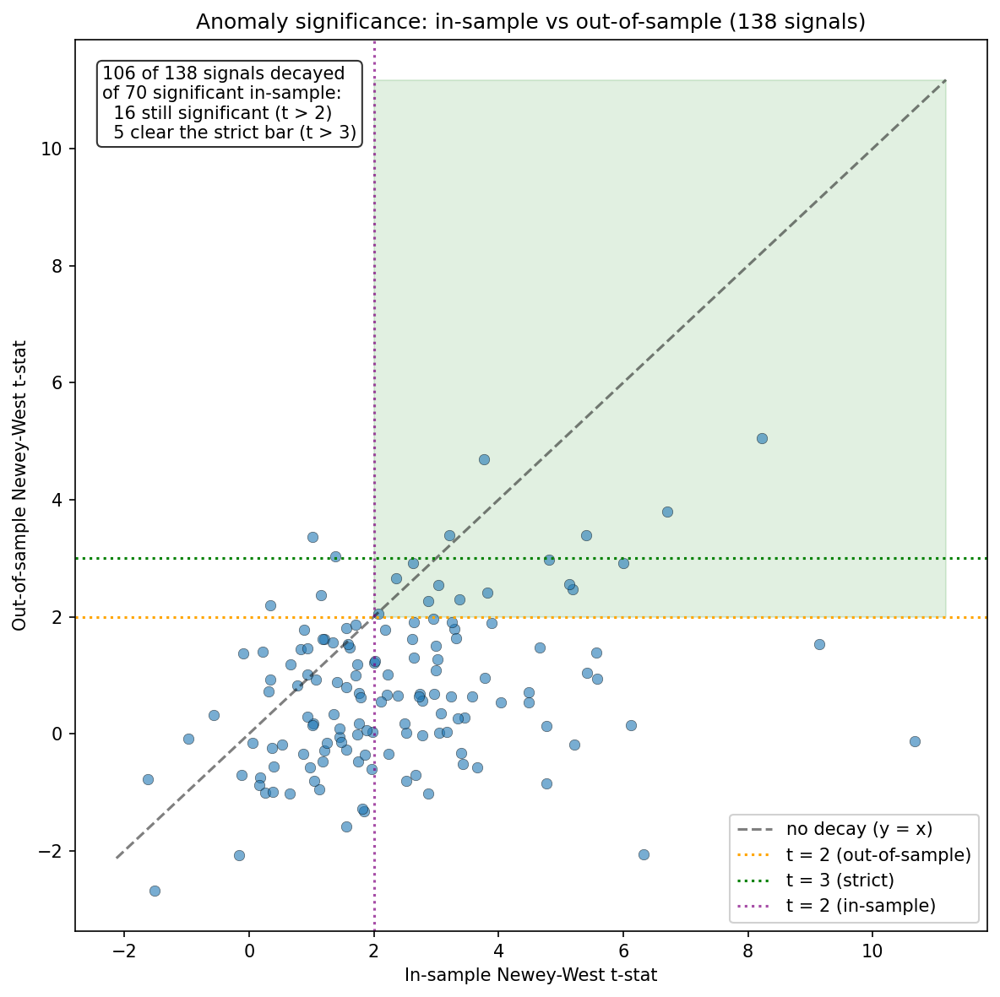
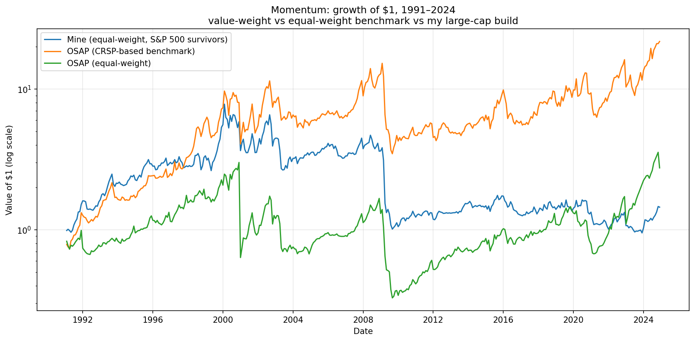

# Factor Forensics

**Do published stock-market anomalies keep working — and can a factor built from free data even measure them honestly?**

This project investigates the reliability of published equity-return "anomalies" from two angles. First, whether their documented predictability survives *out-of-sample*, after the data the original researchers studied. Second, whether a momentum factor rebuilt from scratch on free data can reproduce the professional benchmark — and what the gap between them reveals. The recurring theme is skepticism: distrusting a clean-looking result until it survives contact with data nobody had seen when the finding was made.

---

## Part 1 — Do anomalies survive out-of-sample?

*Notebook: `anomly_decay.ipynb`*

Part 1 builds on the famous McLean & Pontiff (2016) result which found out that academic publication erodes return predictability. This project applies that question to a broad set of 138 anomalies, processed independently from the raw OSAP data, using per-signal sample-end splits and conditional significance testing.
 
Using the [Open Source Asset Pricing](https://www.openassetpricing.com/) (OSAP) database of Chen & Zimmermann, I took 138 high-quality published anomalies, split each at the end of *its own original study's sample period*, and compared performance in-sample vs. out-of-sample. The split is drawn at each signal's `SampleEndYear` because the returns after the original data ended are the first ones nobody had seen when the anomaly was formed, and therefore the honest test.

**The finding:**

- **106 of 138 anomalies (77%) decayed** out-of-sample, with the median anomaly losing about **2.8 percentage points** of annualized return.
- Of the **70 anomalies statistically significant in-sample** (Newey-West *t* > 2), only **16 remained significant out-of-sample**, and just **5** cleared a strict *t* > 3 bar.

*Each point is one anomaly, plotted by its Newey-West t-statistic during vs. after its original study. Points below the diagonal weakened out-of-sample — most did. The survivor quadrant (upper-right, significant on both axes) is sparse.*

This replicates, on independently processed data, the central result of McLean & Pontiff (2016): published predictability tends to erode once a pattern is public, consistent with arbitrage capital flowing toward it. What I practically understood was that in-sample t-stat is a weak promise about the future; a published edge is best treated as an upper bound on what remains.

---

## Part 2 — Building momentum from scratch

*Notebook: `momentum.ipynb`*

A finding is only as trustworthy as the data behind it. So I rebuilt the classic 12-month momentum long-short from *raw* Yahoo Finance prices — no pre-computed portfolios — and validated it against OSAP's professional CRSP-based benchmark.

Building from free data surfaced exactly the messiness that professional databases pre-clean: an impossible -115% portfolio month traced to a single bad price (fixed by winsorizing 46 of 174,086 stock-month returns), and a subtle one-month date-alignment bug that silently drove the benchmark correlation to near-zero until diagnosed.

**The finding:**

- My homemade factor correlates **0.79** with the professional benchmark — it captures the same effect.
- But it earns only about a third of the value-weight benchmark's return (~5% vs ~15% annualized). **Most of that gap is weighting, not survivorship:** against a *matched equal-weight* benchmark the shortfall roughly halves (~10.3pp to ~4.3pp). The residual reflects my large-cap-only universe (momentum is strongest in smaller stocks) and survivorship (today's index excludes the delisted losers a short-momentum leg profits from).

*Same pattern, different magnitude. The gap decomposes: matching the weighting scheme closes more than half of it — honest attribution requires benchmarking against matched constructions rather than assuming a single cause.*

---

## Approach 

Splitting at sample-end, not publication. Each anomaly is tested out-of-sample by splitting its return series at the last year of the original study's data (SampleEndYear), not the publication year. Papers typically publish 2–4 years after their sample ends, so splitting at publication would misclassify genuinely-unseen returns as in-sample. This choice is what makes the out-of-sample period a true test.

Autocorrelation-robust significance. Monthly long-short returns are serially correlated, which inflates ordinary t-statistics. All significance is computed with Newey-West (HAC, 6 lags) standard errors. Momentum, for example, has an in-sample t of 5.16 falling to 2.53 out-of-sample under this correction.

Conditional survivor counts. "How many anomalies stayed significant?" has a wrong answer and a right one. Counting all signals significant out-of-sample (unconditional) gives 20 of 138. But the meaningful question is how many of the 70 that were significant in-sample stayed significant — conditioning on both gives 16, and only 5 at a strict t > 3. The distinction changes the headline.

Cleaning free-data glitches. A single erroneous Yahoo price produced an impossible −115% monthly portfolio return; individual stock-month returns are winsorized to [−90%, +100%], affecting 46 of 174,086 observations (0.03%), with conclusions unchanged without it.

Decomposing the benchmark gap. My homemade momentum earns ~5% annualized vs the professional value-weight benchmark's ~15% — a gap that looks like pure survivorship bias. Comparing instead against a matched equal-weight benchmark narrows it from ~10.3pp to ~4.3pp, showing weighting alone accounts for more than half; the residual is universe and survivorship, which free data cannot separate.

## Honest limitations

- The out-of-sample windows for recently-published anomalies are short, making their t-statistics noisier than long-history signals'.
- OSAP's standardized decile construction differs from each study's exact methodology, so a portion of measured decay may reflect construction rather than pure erosion.
- The momentum universe is large-cap and survivor-only; the gap versus the benchmark reflects weighting, universe, and survivorship combined, which free data cannot fully separate.

## Reproducing

Both notebooks run top to bottom on a fresh kernel and pull data live (OSAP package + Yahoo Finance), so an internet connection is required.

**Tools:** Python, pandas, statsmodels (Newey-West / HAC), matplotlib, yfinance, openassetpricing.

---

*Self-directed research project. Data: Open Source Asset Pricing (Chen & Zimmermann).*
